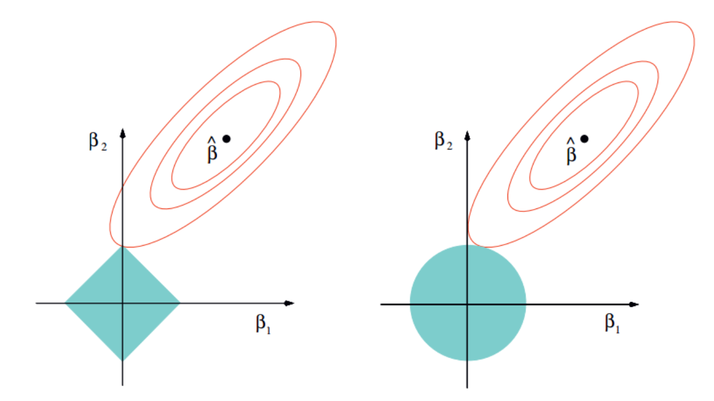

正则化
============

正则化是一种为了减小测试误差的行为(有时候会增加训练误差)。我们在构造机器学习模型时，最终目的是让模型在面对新数据的时候，可以有很好的表现。当你用比较复杂的模型比如神经网络，去拟合数据时，很容易出现过拟合现象(训练集表现很好，测试集表现较差)，这会导致模型的泛化能力下降，这时候，我们就需要使用正则化，降低模型的复杂度。

# 1 范数
首先介绍一下范数的定义，假设$s$是一个向量，它的$L^P$范数定义。

$$
\|x\|_ {p}=\left(\sum_{i=1}^{n}\left|x_{i}\right|^{p}\right)^{\frac{1}{p}}
$$

# 2 正则化
当统计模型把随机误差和噪声也考虑进去而不仅仅是考虑数据的基础关联时，就会出现过过拟合。正则化通过添加参数的惩罚项，防止模型对数据过拟合。

$$
\min _ {\theta} \frac{1}{N} \sum_{i=1}^{N} \mathcal{L}\left(y_{i}, f_{\theta}\left(x_{i}\right)\right)+\lambda \Omega(\theta)
$$

## 2.1 $L1$正则化(套索LASSO)
$L1$正则化时，对应惩罚项为$L1$范数:
$$
\begin{aligned}
&\Omega(\theta)=|| \theta||_ {1}=\sum_{m=1}^{M} | \theta_{m}| \newline
&\min _ {\theta} \frac{1}{N} \sum_{i=1}^{N} \mathcal{L}\left(y_{i}, f_{\theta}\left(x_{i}\right)\right)+\lambda\|\theta\|_ {1}
\end{aligned}
$$
 

## 2.2 $L2$正则化(岭回归Ridge)
$L2$正则化时，对应惩罚项为$L2$范数的平方:
$$
\begin{aligned}
&\Omega(\theta)=|| \theta||_ {2}^{2}=\sum_{m=1}^{M} \theta_{m}^{2} \newline
&\min _ {\theta} \frac{1}{N} \sum_{i=1}^{N} \mathcal{L}\left(y_{i}, f_{\theta}\left(x_{i}\right)\right)+\lambda\|\theta\|_ {2}^{2}
\end{aligned}
$$

## 2.3 $L1、L2$正则化的区别

$L1、L2$正则化的区别

红色的椭圆和蓝色的区域的切点就是目标函数的最优解，我们可以看到，如果是圆，则很容易切到圆周的任意一点，但是很难切到坐标轴上，因此没有稀疏；但是如果是菱形或者多边形，则很容易切到坐标轴上，因此很容易产生稀疏的结果。

# 3 奥卡姆剃刀

## 总结

* $L1$正则化：它的优良性质是能产生稀疏性，导致$W$中许多项变成零，更适用于特征选择。稀疏的解除了计算量上的好处之外，更重要的是更具有“可解释性”。  
* $L2$正则化：使得模型的解偏向于范数较小的$W$，通过限制$W$范数的大小实现了对模型空间的限制，从而在一定程度上避免了过拟合。并不具有产生稀疏解的能力，得到的系数仍然需要数据中的所有特征才能计算预测结果，从计算量上来说并没有得到改观。  

## 参考
https://www.jianshu.com/p/c9bb6f89cfcc   
https://blog.csdn.net/qq_25847123/article/details/90400678  
https://www.boyuai.com/  

